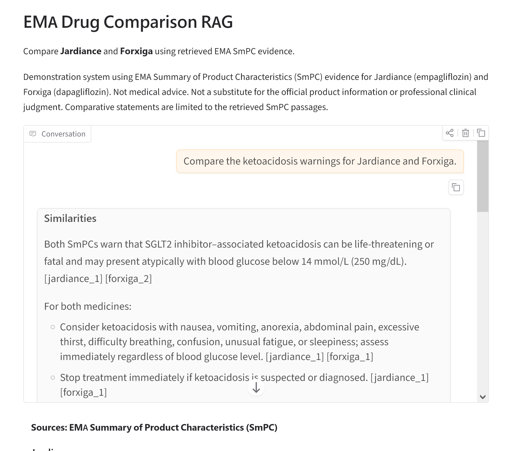
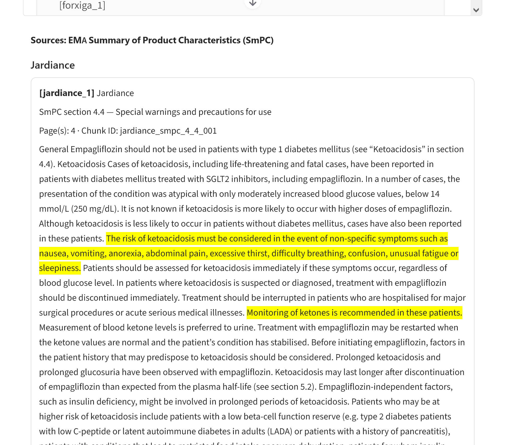

# EMA Drug Comparison RAG

A retrieval-augmented generation (RAG) system for comparing European Medicines Agency (EMA) product information for **Jardiance (empagliflozin)** and **Forxiga (dapagliflozin)**.

The project retrieves evidence from the EMA **Summary of Product Characteristics (SmPC)**, reranks candidate passages, balances evidence across both medicines, expands relevant evidence within the same regulatory section, and generates a grounded comparative answer with evidence citations.

## Demo

## Demo

### Grounded comparison

The application answers comparative questions using retrieved EMA SmPC evidence
and cites the supporting evidence directly in the generated response.



### Evidence traceability

Retrieved passages retain the medicine, SmPC section, page, and chunk provenance.
Answer-relevant sentences are highlighted to make source verification easier.



> **Disclaimer:** This project is a demonstration system. It is not medical advice and is not a substitute for official EMA product information or professional clinical judgment. Comparative statements are limited to the retrieved SmPC evidence.

## Why This Project?

Drug comparison is a useful RAG use case because clinically relevant information is distributed across standardized regulatory sections rather than contained in a single passage.

For example, comparisons may require evidence concerning:

- therapeutic indications;
- posology and method of administration;
- contraindications;
- warnings and precautions;
- adverse reactions;
- pharmacodynamic properties; and
- pharmacokinetic properties.

A reliable system therefore needs more than generic document chunking and vector search. This project explores a **regulatory-document-aware retrieval architecture** that preserves SmPC section structure and page provenance.

## Architecture

```text
EMA Product Information PDFs
        |
        v
Extract Annex I (SmPC)
        |
        v
Parse standardized SmPC sections
        |
        v
Section-aware, page-aware chunking
        |
        v
Sentence-transformer embeddings
        |
        v
Bi-encoder candidate retrieval
        |
        v
Cross-encoder reranking
        |
        v
Balanced evidence selection
(Jardiance + Forxiga)
        |
        v
Same-section neighbor expansion
        |
        v
Grounded LLM generation
        |
        v
Answer + evidence IDs + highlighted sources
```

The application deliberately separates retrieval, evidence construction, generation, and presentation so that UI features such as highlighting do not alter the validated retrieval pipeline.

## Data Sources

The current version uses official European Medicines Agency (EMA) Product Information for:

- **Jardiance (empagliflozin)** — [EMA EPAR](https://www.ema.europa.eu/en/medicines/human/EPAR/jardiance)
- **Forxiga (dapagliflozin)** — [EMA EPAR](https://www.ema.europa.eu/en/medicines/human/EPAR/forxiga)

Only **Annex I (Summary of Product Characteristics, SmPC)** is used for the current RAG corpus.

The source PDFs are parsed while preserving regulatory section numbers and page provenance.

## SmPC-Aware Chunking

Instead of blindly dividing the PDFs into fixed-size blocks, the preprocessing pipeline first identifies the standardized SmPC sections.

Each chunk contains metadata including:

```text
chunk_id
drug
active_substance
source
document_type
source_file
section
section_title
pages
chunk_index
text
```

The current corpus contains:

- **48 Jardiance chunks**
- **51 Forxiga chunks**
- **99 chunks total**

This allows retrieved passages to remain traceable to the corresponding medicine, SmPC section, and source pages.

## Embeddings and Retrieval

Dense retrieval uses:

```text
sentence-transformers/all-MiniLM-L6-v2
```

The resulting embedding matrix contains:

```text
99 x 384
```

Candidate passages are retrieved separately for each medicine to avoid one drug dominating the evidence set.

## Cross-Encoder Reranking

Candidate passages are reranked using:

```text
cross-encoder/ms-marco-MiniLM-L-6-v2
```

The retrieval pipeline uses a larger candidate pool before selecting the strongest evidence for each medicine.

This provides a two-stage retrieval architecture:

```text
Bi-encoder retrieval
        ↓
Cross-encoder reranking
```

## Balanced Evidence Selection

A drug-comparison system should not return excellent evidence for one medicine while providing little evidence for the other.

The retriever therefore selects evidence independently for:

```text
Jardiance
Forxiga
```

before combining the results into the evidence package supplied to the generator.

## Same-Section Neighbor Expansion

A retrieved chunk may contain only part of a clinically important regulatory statement.

After reranking, the evidence layer therefore expands selected passages with immediately adjacent chunks when they belong to the:

- same medicine; and
- same SmPC section.

This improved evidence completeness without changing the underlying semantic retrieval model.

## Grounded Answer Generation

The generator receives only the selected EMA evidence and is instructed to:

- answer from the supplied evidence;
- compare the two medicines directly;
- preserve clinically important differences;
- avoid unsupported claims;
- cite the supplied evidence IDs;
- never invent evidence IDs; and
- state when the available evidence is insufficient.

The application uses the existing validated pipeline:

```text
retrieval
→ reranking
→ balanced per-drug evidence
→ same-section neighbor expansion
→ grounded generation
```

## Evidence Highlighting

The Gradio interface includes a presentation-only evidence highlighter.

For each retrieved evidence passage, the application:

1. splits the passage into sentences;
2. measures lexical overlap with the generated answer;
3. identifies the strongest answer-relevant sentences;
4. highlights at most two sentences; and
5. preserves their original order.

Highlighting does **not** influence retrieval, reranking, evidence selection, or generation.

Its purpose is to make source verification easier for the user.

## Evaluation

The system was evaluated using **20 manually constructed drug-comparison questions** aligned with standardized SmPC topics.

### Retrieval

| Metric | Result |
|---|---:|
| Jardiance retrieval accuracy | 95% |
| Forxiga retrieval accuracy | 95% |
| Paired retrieval accuracy | 95% |

The paired metric requires relevant evidence to be retrieved for both medicines.

### Evidence Coverage

A separate evidence-level evaluation measured whether expected comparison points were actually supported by the evidence package supplied to the generator.

| Metric | Result |
|---|---:|
| Overall evidence coverage | **93.0%** |
| Supported expected points | **185 / 199** |
| Questions evaluated | 20 |

Nineteen of the twenty evaluation questions achieved complete evidence coverage.

### Generation Coverage

The grounded generation evaluation reached:

**87.3% overall generation coverage**

with **12 of 20 questions receiving complete coverage** of the expected comparison points.

This distinction between evidence coverage and generation coverage is important: retrieval may supply the required information even when the language model does not use every available point in its final answer.

## Known Limitation: Broad Multi-Intent Queries

The principal failure case is `eval_003`.

This question combines several different topics within SmPC section 4.2:

- hepatic impairment;
- elderly patients;
- pediatric use; and
- method of administration.

The relevant information exists in section 4.2 for both medicines, but the dense semantic retriever tends to select passages from other sections that are individually semantically related to these subtopics.

For this question, evidence coverage was only **6.7%**.

By contrast, the other **19 evaluation questions achieved 100% evidence coverage**.

The current architecture therefore performs best when the query addresses **one focused regulatory topic at a time**.

This failure case is intentionally retained in the evaluation rather than removed after observing the results.

## Project Structure

```text
ema_drug_comparison_rag/
├── app.py
├── assets/
│   └── ema_rag_demo.png
├── data/
│   ├── raw/
│   ├── processed/
│   └── embeddings/
├── evaluation/
│   ├── questions.json
│   ├── evaluation.py
│   ├── evaluate_generation.py
│   ├── evaluate_evidence.py
│   ├── generation_results.json
│   └── evidence_results.json
├── notebooks/
│   └── ema_rag_demo.ipynb
├── src/
│   ├── download_documents.py
│   ├── inspect_documents.py
│   ├── extract_smpc.py
│   ├── parse_sections.py
│   ├── create_chunks.py
│   ├── inspect_chunks.py
│   ├── build_embeddings.py
│   ├── search.py
│   ├── search_reranked.py
│   ├── retriever.py
│   ├── evidence.py
│   ├── evidence_highlighter.py
│   ├── generator.py
│   └── ask.py
└── tests/
    └── test_chunks.py
```

## Installation

Clone the repository and create a Python environment.

For example, using `uv`:

```bash
uv venv --python 3.12
```

Activate the environment.

Windows PowerShell:

```powershell
.\.venv\Scripts\Activate.ps1
```

Install the project dependencies:

```bash
pip install -r requirements.txt
```

## Configuration

Create a `.env` file in the repository root:

```text
OPENAI_API_KEY=your_api_key_here
```

Do not commit the `.env` file or API keys to Git.

An example configuration is provided in `.env.example`.

## Docker

The application can also be run in a Docker container.

Build the image:

```bash
docker build -t ema-rag:v1 .
```

Run the container with the environment variables defined in `.env`:

```bash
docker run --name ema-rag -p 7860:7860 --env-file .env ema-rag:v1
```

Then open:

```text
http://localhost:7860
```

The `.env` file is excluded from the Docker build context and should never be committed to the repository.

## Running the Gradio Application

From the repository root:

```bash
python app.py
```

Open the local Gradio URL displayed in the terminal.

Example question:

```text
Compare the ketoacidosis warnings for Jardiance and Forxiga.
```

The interface displays:

- conversation history;
- the grounded comparative answer;
- EMA SmPC evidence for the latest question;
- evidence IDs;
- SmPC sections and titles;
- source pages;
- chunk IDs; and
- answer-relevant highlighted sentences.

## CLI Usage

The RAG pipeline can also be used without the web interface:

```bash
python -m src.ask
```

## Tests

Run the deterministic chunk-integrity tests with:

```bash
python -m pytest tests/test_chunks.py -v
```

The current suite checks:

- total corpus size;
- presence of both medicines;
- unique chunk IDs;
- page provenance;
- required metadata;
- expected per-drug chunk counts; and
- presence of section 4.2 for both medicines.

Current result:

```text
7 passed
```

## Evaluation Files

The `evaluation/` directory contains the evaluation questions and scripts used to measure retrieval, evidence, and generation performance.

Full LLM-based evaluation can incur API costs. Deterministic tests and targeted diagnostics are preferable during routine development.

## Limitations

This project currently:

- compares only Jardiance and Forxiga;
- uses the EMA SmPC rather than the complete regulatory evidence base;
- depends primarily on semantic retrieval and therefore performs less reliably on broad multi-intent questions;
- does not replace review of the official product information;
- does not provide patient-specific medical recommendations; and
- uses lexical answer-aware highlighting rather than a separately trained evidence-attribution model.

## Future Work

Possible extensions include:

- EMA EPAR assessment reports;
- Risk Management Plans and pharmacovigilance information;
- post-authorisation regulatory changes;
- hybrid lexical + semantic retrieval;
- explicit regulatory-section routing;
- improved multi-intent query handling;
- broader drug comparisons;
- systematic citation-faithfulness evaluation; and
- deployment using privacy-conscious or enterprise infrastructure.

## Disclaimer

This repository is an educational and technical demonstration of retrieval-augmented generation for pharmaceutical regulatory documents.

It is **not medical advice** and should not be used as a substitute for the official EMA product information, regulatory review, or professional clinical judgment.
